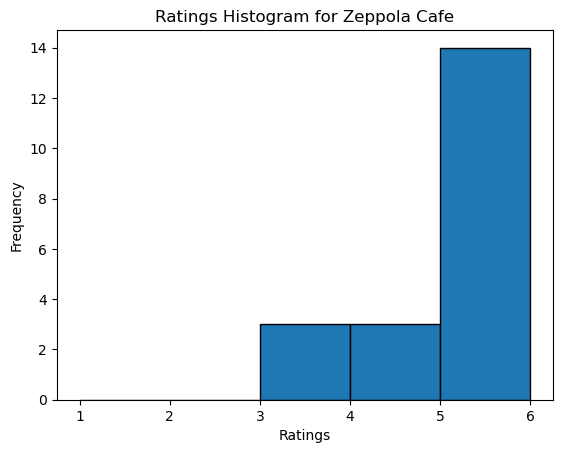

# Final Project - Annika Xu

This is a python package that can help users select restaurants given location, cuisine, price range, ratings, etc. When travelling to a new places. People usually don't know what to eat and spend a lot of time to think about which restaurant to go to. This python package has various functions that can help people make better decisions.

## Using My Package

- Package Repository: https://github.com/QMSS-G5072-2023/restaurantapi_pyclient
- TestPyPI Package: https://test.pypi.org/project/restaurantapi_pyclient/

## Installation

You can install my package from TestPyPI using the following command: "pip install -i https://test.pypi.org/simple/ restaurantapi_pyclient"

## Import package


```python
pip install -i https://test.pypi.org/simple/ restaurantapi_pyclient
```

    Looking in indexes: https://test.pypi.org/simple/
    Collecting restaurantapi_pyclient
      Obtaining dependency information for restaurantapi_pyclient from https://test-files.pythonhosted.org/packages/28/5e/97500af6bcf7f0fcc1debc18c3f86544cc5ac73934f6504831b60df62c73/restaurantapi_pyclient-0.1.0-py3-none-any.whl.metadata
      Downloading https://test-files.pythonhosted.org/packages/28/5e/97500af6bcf7f0fcc1debc18c3f86544cc5ac73934f6504831b60df62c73/restaurantapi_pyclient-0.1.0-py3-none-any.whl.metadata (9.8 kB)
    Downloading https://test-files.pythonhosted.org/packages/28/5e/97500af6bcf7f0fcc1debc18c3f86544cc5ac73934f6504831b60df62c73/restaurantapi_pyclient-0.1.0-py3-none-any.whl (8.0 kB)
    Installing collected packages: restaurantapi_pyclient
    Successfully installed restaurantapi_pyclient-0.1.0
    Note: you may need to restart the kernel to use updated packages.


## Now the package is successfully downloaded and can be used


```python
from restaurantapi_pyclient import restaurantapi_pyclient
```

## Let's check my functions ...
## For example, search restaurants near las vegas, location_id is 45963
'query_restaurants_in_location' queries restaurants in a specific location. Imagine, when you travels to a new place and didn't know what to eat, you can simply use this function to help you. By simply typing your location id, the currency you want to pay, and the language you speak, the function will generates a list of restaurants near you. The list contains the name of the restaurant, its price level, ratings, description and a photo url of it.


```python
from restaurantapi_pyclient.restaurantapi_pyclient import query_restaurants_in_location

# Test the query_restaurants_in_location function
api_key = os.environ.get('RES_API')
location_id = '45963'
language = "en_US"
currency = "USD"

result = query_restaurants_in_location(api_key, location_id, language, currency)
```

    Restaurants Nearby:
    Restaurant Name: Zeppola Cafe
    Rating: 5.0
    Price Level: $$ - $$$
    Description: With Zeppola cafe at The Venetian  coming to life, we aim to combine our restaurant experience with our Italian love and tradition for the most authentic  pastries and sweets. Not only an exposition of products for the customers to choose from ( our bakery side ), but also a full upscale restaurant experience for all of our guests to enjoy. All the way, all day long.
    Photo URL: https://media-cdn.tripadvisor.com/media/photo-t/23/87/d7/26/pastries-and-drinks.jpg
    -------------
    Restaurant Name: Primal Steakhouse
    Rating: 5.0
    Price Level: $$$$
    Description: None
    Photo URL: https://media-cdn.tripadvisor.com/media/photo-t/21/70/c1/0f/house-cocktail-at-primal.jpg
    -------------
    Restaurant Name: Eggscellent
    Rating: 5.0
    Price Level: $
    Description: None
    Photo URL: https://media-cdn.tripadvisor.com/media/photo-t/23/71/8c/d3/spicy-box.jpg
    -------------
    Restaurant Name: Benihana
    Rating: 4.5
    Price Level: $$ - $$$
    Description: The world-famous Benihana is a restaurant in Las Vegas at Westgate Las Vegas Resort & Casino that specializes in hibachi-style Japanese cuisine surrounded by scenic Japanese gardens and flowing ponds. The talented chefs at Benihana prepare both traditional and innovative teppanyaki dishes nightly with menu items that include filet mignon, teriyaki steak and hibachi chicken. Private dining rooms are available for special functions.
    Photo URL: https://media-cdn.tripadvisor.com/media/photo-t/13/07/3c/ca/benihana.jpg
    -------------
    Restaurant Name: Edge Steakhouse
    Rating: 5.0
    Price Level: $$$$
    Description: The award-winning Edge Steakhouse is an immensely popular restaurant in Las Vegas at Westgate Las Vegas Resort & Casino. Edge Steakhouse features top quality Prime Cuts, Domestic Wagyu Beef, fresh seafood and other creative entrees, along with specialty appetizers and delectable side dishes. An extensive wine selection is also available.
    Photo URL: https://media-cdn.tripadvisor.com/media/photo-t/24/83/89/53/edge-wagyu.jpg
    -------------
    Restaurant Name: Vic & Anthony's Steakhouse
    Rating: 4.5
    Price Level: $$$$
    Description: Vic & Anthony's Steakhouse features an elegant, yet intimate atmosphere, created with an undeniable attention to detail. Our award-winning menu features only the finest prime beef, fresh seafood, delectable desserts, as well as an extensive wine collection.
    Photo URL: https://media-cdn.tripadvisor.com/media/photo-t/02/3b/d5/f0/pick-your-tail.jpg
    -------------
    Restaurant Name: Fresco Italiano
    Rating: 4.5
    Price Level: $$ - $$$
    Description: Creative Italian-style cuisine is the hallmark of Fresco Italiano, a Tuscan-inspired restaurant in Las Vegas located within Westgate Las Vegas Resort & Casino. Enjoy your favorite pasta combined with a variety of freshly made sauces, or try one of the handcrafted flatbreads, steaks, chicken or fresh seafood.
    Photo URL: https://media-cdn.tripadvisor.com/media/photo-t/1b/1f/ff/40/lasagna-ricotta-bolognese.jpg
    -------------
    Restaurant Name: Senor Frog's Las Vegas
    Rating: 4.5
    Price Level: $$ - $$$
    Description: If you've ever been to a Senor Frog's, anywhere around the world, you already know that we're a place where people of all backgrounds hang together, dance, sing and basically act the way they want without worrying about silly rules and regulations. Our philosophy is simple: have fun, let yourself go and unleash your fiesta!
    Photo URL: https://media-cdn.tripadvisor.com/media/photo-t/11/bf/a0/55/hello-froggies.jpg
    -------------
    Restaurant Name: Sid's Cafe
    Rating: 4.0
    Price Level: $$ - $$$
    Description: Welcome to Sid's Café in Las Vegas, where endless breakfasts, delectable appetizers, scrumptious burgers, and delightful desserts await you! Sid's offers a creative approach to homestyle cooking with large portions and friendly service that will surprise and delight you every time! Located immediately adjacent to the casino floor at Westgate Las Vegas Resort & Casino, Sid's has been a longtime local favorite for over 20 years!
    Photo URL: https://media-cdn.tripadvisor.com/media/photo-t/2a/5e/67/b9/breakfast-bounty.jpg
    -------------
    Restaurant Name: Weera Thai Restaurant
    Rating: 4.5
    Price Level: $$ - $$$
    Description: For 30 years, we have served authentic Thai-Issan cuisine in Chiangmai, Thailand, where we were well-known for our distinctive, flavorful dishes. We've since brought our dishes to the states, and couldn't be happier to have done so. At Weera Thai, we take great pride in serving fresh quality ingredients. We welcome you to explore our food culture right here in Las Vegas. Besides are delectable dishes, we also offer a wide selection of beers including imported Thai beer, Corona, and Heineken. We also serve wine! Takeout and Delivery are also available! We deliver to The Strip. We offer fast, 15 minute pick-up and 30 minute delivery to anyone within a 3-4 mile radius.
    Photo URL: https://media-cdn.tripadvisor.com/media/photo-t/0f/36/09/a2/salad.jpg
    -------------
    Restaurant Name: Crepe Expectations
    Rating: 4.5
    Price Level: $$ - $$$
    Description: Our restaurant will be closed from the 21st to 26th of December 2015 included.
    Photo URL: https://media-cdn.tripadvisor.com/media/photo-t/05/04/b1/90/crepe-expectations.jpg
    -------------
    Restaurant Name: Esther's Kitchen
    Rating: 4.5
    Price Level: $$ - $$$
    Description: Esther's Kitchen is a seasonal neighborhood Italian Restaurant located in the Las Vegas Arts District. We serve fresh Pasta, Pizzas, Vegetables, Proteins, Wine, Beer, Cocktails. Lunch, Dinner and Brunch. Esther's Kitchen has been proud to win several "Best Italian" "Best Downtown" and "Best Brunch" designations in several polls. In 2020 Chef James Trees was named a finalist for James Beard Best Chef Southwest.
    Photo URL: https://media-cdn.tripadvisor.com/media/photo-t/26/50/ae/fc/spaghettoni-alla-gricia.jpg
    -------------
    Restaurant Name: Italian American Club
    Rating: 4.5
    Price Level: $$ - $$$
    Description: None
    Photo URL: https://media-cdn.tripadvisor.com/media/photo-t/0a/14/cd/e6/photo3jpg.jpg
    -------------
    Restaurant Name: Garrett Popcorn Shops
    Rating: 4.5
    Price Level: $
    Description: Since 1949, Garrett Popcorn Shops has been the home of the original Chicago-style popcorn. Fans and popcorn lovers from around the world line up outside our shops for our irresistible cheddar cheese and caramel popcorn mix. Our menu also includes plain, buttery, cheese, caramel, cashew, almond, pecan, macadamia, and seasonal flavors. Dedicated to preserving our secret family recipes, we only use high-quality, local ingredients to create our delicious popcorn in old-fashioned copper kettles. Made fresh daily in small batches, our gourmet popcorn is gluten free, preservative free, and full of delicious flavors. Stop by our shops to try our famous treats or order your popcorn tins online. Join our mailing list and follow us on social media to be the first to know the latest news and promotions.
    Photo URL: https://media-cdn.tripadvisor.com/media/photo-t/07/55/53/83/garretts-popcorn.jpg
    -------------
    Restaurant Name: Mr. Mamas
    Rating: 4.5
    Price Level: $
    Description: Mr. Mama's is a Breakfast and Lunch diner that specializes in home cooking. Some of our favorite dishes include the Cali Omelet, Mama's Chicken Fried Steak and Eggs and our French Toast/ Pancakes. OH! and don't forget about our monstrous cinnamon rolls! The menu also offers lunch items; some favorite are the Mamas Sandwich, Philly Cheese Steak and Reuben! The environment is casual, family friendly and full of smiles from the staff! We promise our place will put a smile on your face!
    Photo URL: https://media-cdn.tripadvisor.com/media/photo-t/06/12/5b/b4/veggie-omelette-with.jpg
    -------------
    Restaurant Name: Juan's Flaming Fajitas & Cantina
    Rating: 4.5
    Price Level: $$ - $$$
    Description: None
    Photo URL: https://media-cdn.tripadvisor.com/media/photo-t/0f/c4/38/e3/combo-plate-with-vegetables.jpg
    -------------
    Restaurant Name: Arawan Thai Bistro
    Rating: 4.5
    Price Level: $$ - $$$
    Description: We would like to take this opportunity to welcome you to your home to great tasting Thai dishes. We serve only the freshest and finest ingredients."
    Photo URL: https://media-cdn.tripadvisor.com/media/photo-t/0e/0a/ba/c5/17.jpg
    -------------
    Restaurant Name: Casa Di Amore
    Rating: 4.5
    Price Level: $$ - $$$
    Description: Casa Di Amore is a locally owned business that celebrates "Las Vegas, the way it used to be!" along with cuisine that excels at every level. The ambiance is superb, with candle lit tables and huge photo art depicting old Vegas casinos, all set to live jazz and standards performed nightly. Guests can call and request complimentary transportation to and from their hotel, which only adds to the unique experience that is Casa Di Amore. Open until 4AM.
    Photo URL: https://media-cdn.tripadvisor.com/media/photo-t/02/51/7f/d7/mini-cannoli-s.jpg
    -------------
    Restaurant Name: Le Cirque
    Rating: 4.5
    Price Level: $$$$
    Description: Experience the timeless sensation created by charismatic Restaurateur, Sirio Maccioni. The rarity of Le Cirque's AAA Five Diamond and Forbes Five Star ratings speaks eloquently of French cuisine - exquisite, bold, transcendent. Immerse yourself in a jubilant showing of brilliant color adorning this famed lakeside destination designed by Adam D. Tihany. Exuding a celebratory mood, Le Cirque's opulent dining room is enhanced with coveted wines and attentive service, which come together to amuse your taste buds in celebrated Maccioni family fashion.
    Photo URL: https://media-cdn.tripadvisor.com/media/photo-t/06/27/51/0a/le-cirque-bellagio.jpg
    -------------
    Restaurant Name: Bubba Gump Shrimp Co.
    Rating: 4.0
    Price Level: $$ - $$$
    Description: Since 1996, Bubba Gump Shrimp Co. has been entertaining guests with a charming down-home style that's a hit with eaters around the globe.
    Our menu offers a number of items for the shrimp lover in all of us. Boasting creative seafood dishes inspired straight from the movie Forrest Gump and a fun family atmosphere, Bubba Gump Shrimp Co. will have you running to the nearest location you can find!
    Photo URL: https://media-cdn.tripadvisor.com/media/photo-t/05/f0/bf/f7/bubba-gump-shrimp-company.jpg
    -------------


## Then if you want to sort nearby restaurants by ratings.
'sort_restaurants_by_ratings' is build upon the first function. After displaying the restaurants nearby, you can also redesign the list of the restaurants. This function helps you rank the restaurant nearby from highest ratings to lowest.


```python
from restaurantapi_pyclient.restaurantapi_pyclient import sort_restaurants_by_ratings
import os

api_key = os.environ.get('RES_API')
location_id = '45963'
language = "en_US"
currency = "USD"

result = sort_restaurants_by_ratings(api_key, location_id, language, currency)
```

    Sorted Restaurants by Ratings:
    -------------
    Restaurant Name: Zeppola Cafe
    Rating: 5.0
    Price Range: $$ - $$$
    -------------
    Restaurant Name: Primal Steakhouse
    Rating: 5.0
    Price Range: $$$$
    -------------
    Restaurant Name: Eggscellent
    Rating: 5.0
    Price Range: $
    -------------
    Restaurant Name: Edge Steakhouse
    Rating: 5.0
    Price Range: $$$$
    -------------
    Restaurant Name: Benihana
    Rating: 4.5
    Price Range: $$ - $$$
    -------------
    Restaurant Name: Vic & Anthony's Steakhouse
    Rating: 4.5
    Price Range: $$$$
    -------------
    Restaurant Name: Fresco Italiano
    Rating: 4.5
    Price Range: $$ - $$$
    -------------
    Restaurant Name: Senor Frog's Las Vegas
    Rating: 4.5
    Price Range: $$ - $$$
    -------------
    Restaurant Name: Weera Thai Restaurant
    Rating: 4.5
    Price Range: $$ - $$$
    -------------
    Restaurant Name: Crepe Expectations
    Rating: 4.5
    Price Range: $$ - $$$
    -------------
    Restaurant Name: Esther's Kitchen
    Rating: 4.5
    Price Range: $$ - $$$
    -------------
    Restaurant Name: Italian American Club
    Rating: 4.5
    Price Range: $$ - $$$
    -------------
    Restaurant Name: Garrett Popcorn Shops
    Rating: 4.5
    Price Range: $
    -------------
    Restaurant Name: Mr. Mamas
    Rating: 4.5
    Price Range: $
    -------------
    Restaurant Name: Juan's Flaming Fajitas & Cantina
    Rating: 4.5
    Price Range: $$ - $$$
    -------------
    Restaurant Name: Arawan Thai Bistro
    Rating: 4.5
    Price Range: $$ - $$$
    -------------
    Restaurant Name: Casa Di Amore
    Rating: 4.5
    Price Range: $$ - $$$
    -------------
    Restaurant Name: Le Cirque
    Rating: 4.5
    Price Range: $$$$
    -------------
    Restaurant Name: Sid's Cafe
    Rating: 4.0
    Price Range: $$ - $$$
    -------------
    Restaurant Name: Bubba Gump Shrimp Co.
    Rating: 4.0
    Price Range: $$ - $$$
    -------------


## Then if you want to specifically check the details of Zeppola Cafe from the list
'get_specific_restaurant_details' allows you to pick a specific restaurant and provides much more details for that restaurants. The output contains a comprehensive list of all reviews about the specific restaurant as well as a histogram of its rating scores.


```python
from restaurantapi_pyclient.restaurantapi_pyclient import get_specific_restaurant_details

api_key = os.environ.get('RES_API')
location_id = '45963'
language = "en_US"
currency = "USD"
restaurant_name = "Zeppola Cafe"

result2 = get_specific_restaurant_details(api_key, restaurant_name, location_id, language, currency)
```

    Restaurant Details:
    Name: Zeppola Cafe
    Rating: 5.0
    Price Level: $$ - $$$
    Address: 3377 Las Vegas Blvd S #2390, Las Vegas, NV 89109
    Phone: +1 725-204-6595
    Website: https://www.zeppolacafe.com/?y_source=1_OTI5MDA2MzgtNzY5LWxvY2F0aW9uLndlYnNpdGU%3D
    -------------
    Display All Reviews:
    Rating: 3
    Text: The service is so slow and not up to the expectations of a recommended place for breakfast. Cleaning the tables does not seem a priority. Not enough personnel makes this place so inefficient. The food is good but looks better than it tastes. I may give it another try with hopes they improve because their location is so beautiful.
    -------------
    Rating: 5
    Text: My daughter and I went for dessert and coffee and really enjoyed the food and ambience. The employees are very friendly especially the woman who was standing outside seating guests.
    -------------
    Rating: 4
    Text: This spot is ok, the bread is good, but not a big deal, whats best? its location inside The Venetian!
    -------------
    Rating: 3
    Text: The cafe is great, the bakery was great too and the crew was very efficient, but the manager (only one with a suit) was disrespectful and rude.   One customer before me asked him about what comes with the eggs and he just responded that the answer was on the menu!  I asked for our coffees and he responded he didn’t make them as he was waiting for us to come for it.   I loved Zeppola, both, in NY and in LV’s but people like this just speak very bad about a company.  If he treats customers like this, he probable treats employees even worst. 
    
    This happened on Nov 23 around 11 AM
    -------------
    Rating: 4
    Text: Cute little Cafe. We did find it a little expensive, but what do you expect, its in the Venetian.
    We ordered cappuccino, cannoli, and croissants filled with pistachio cream. They were all really good, but I found the croissant to have too much cream and it was super sweet. 
    -------------
    Rating: 5
    Text: The 2nd floor view is beautiful. Take note , you order up front and then go upstairs, window seating is extremely limited . Take note the portions are HUGE . We ordered a side of eggs and bacon and you could have fed a family of 5 off of it. Share meals !! Food was very good , it is located in the canal shops inside the Venetian . Pastry were fabulous 
    -------------
    Rating: 3
    Text: We had tea, coffee and a fruit tart here, the customer service left a lot to be desired, the person serving us was miserable and it showed, no thankyou or conversation. The fruit tart was the most expensive pastry we had on the Strip and it was the smallest with little fruit especially for the price. We sat upstairs overlooking St Marks Square so at least the location is good, but we would not be back as there as so many better cafe's in the area. 
    -------------
    Rating: 5
    Text: The St Mark’s Square atmosphere, the Illy coffee and beautifully presented food and pastries were superb! Will definitely return.
    -------------
    Rating: 5
    Text: My son and I were eating in the restaurant next to Zappola and saw the goodies and decided to try them for dessert.  Great cannolis and coffee.  We returned the next two mornings for croissants, breakfast sandwiches and coffee.  Coffee so much better that Starbucks   
    -------------
    Rating: 5
    Text: Stopped in here specifically to get some cannolis and I was not disappointed! They were a good size and very tasty. I also got blue lemonade, I think that was the name. That was also very good. Recommend going here!
    -------------
    Rating: 5
    Text: Absolutely pleasant breakfast. Delicious, oversized cream and pistachio croissants, coffee and cappuccino met the expectations. Friendly and efficient staff. Recommended!
    -------------
    Rating: 5
    Text: Great customer service and good foods. 
    People are really nice and pleasant. Coffee is delicious pastry melts in your mouth. I will recommend this highly 
    -------------
    Rating: 5
    Text: Staff were super friendly and helpful and nice and pastries were delicious and fresh tasting like italy, highly recommended 
    -------------
    Rating: 5
    Text: Very friendly and inviting. Ordered coffee and pastries. Everything looks and taste great. This place has been the go to dessert place at Venetian hotel and casino.
    -------------
    Rating: 5
    Text: Great place to eat breakfast 
    Lovely setting and staff are super helpful. 
    We eat here every morning 
    -------------
    Rating: 5
    Text: This place was so good. The selection was big and many choice options on drinks. Highly recommend this place when you are at the Venetian. 
    -------------
    Rating: 5
    Text: Excellent food 👌 All what we tasted was very delicious, it's worth to stay here and it's absolutely worth the money. Also if you're vegetarian u can eat here very good!!
    -------------
    Rating: 5
    Text: If you're looking for a cozy Italian cafe that offers delicious coffee and treats, then Zeppola Cafe is a great option. The stylish and warm decor matched with the fantastic food and beverage options make this place a delight to visit. The owners are friendly and hospitable, and the service is top-notch, making your visit more pleasant. Whether you're looking to catch up with friends over a coffee or need a quick bite to-go, Zeppola Cafe has you covered. Their pastries are particularly noteworthy and definitely worth trying out. If you're in the area and want to enjoy a little slice of Italy, then head over to Zeppola Cafe - you won't be disappointed.
    -------------
    Rating: 5
    Text: This cafe is great, a big selection of authentic Italian pastries. Delicious! Would definitely come back next time! 
    -------------
    Rating: 4
    Text: Nice place to take a rest, after walking and shopping in Venetian. Fine Icecreams and very good cannoli.
    -------------


    

    


## Also get all the cuisine type of Zeppola Cafe
'get_cuisine_for_restaurant' is parallel to the above function that can give you a detailed list of how many cuisines that your selected restaurant has.


```python
from restaurantapi_pyclient.restaurantapi_pyclient import get_cuisine_for_restaurant

api_key = os.environ.get('RES_API')
location_id = '45963'
language = "en_US"
currency = "USD"
restaurant_name = "Zeppola Cafe"

cuisine_info = get_cuisine_for_restaurant(api_key, restaurant_name, location_id, language, currency)
```

    Cuisine for Zeppola Cafe: Italian, American, Cafe


## Want to search restaurants nearby by cuisine type 'American'
'search_restaurants_by_cuisine' can help you re-filter the list of restaurants nearby. By selecting a specific cuisine, the output will contains a list of restaurants in your selected cuisine.


```python
from restaurantapi_pyclient.restaurantapi_pyclient import search_restaurants_by_cuisine

api_key = os.environ.get('RES_API')
location_id = '45963'
language = "en_US"
currency = "USD"
cuisine_name = 'American'

matching_restaurants = search_restaurants_by_cuisine(api_key, cuisine_name, location_id, language, currency)
```

    Restaurants with American cuisine:
    Name: Zeppola Cafe
    Rating: 5.0
    Price Level: $$ - $$$
    -------------
    Name: Primal Steakhouse
    Rating: 5.0
    Price Level: $$$$
    -------------
    Name: Eggscellent
    Rating: 5.0
    Price Level: $
    -------------
    Name: Edge Steakhouse
    Rating: 5.0
    Price Level: $$$$
    -------------
    Name: Vic & Anthony's Steakhouse
    Rating: 4.5
    Price Level: $$$$
    -------------
    Name: Sid's Cafe
    Rating: 4.0
    Price Level: $$ - $$$
    -------------
    Name: Crepe Expectations
    Rating: 4.5
    Price Level: $$ - $$$
    -------------
    Name: Garrett Popcorn Shops
    Rating: 4.5
    Price Level: $
    -------------
    Name: Mr. Mamas
    Rating: 4.5
    Price Level: $
    -------------
    Name: Bubba Gump Shrimp Co.
    Rating: 4.0
    Price Level: $$ - $$$
    -------------


## Still can't decide? Ask the my package to randomly generate a restaurant nearby.
'get_random_restaurant' will help you randomly select a restaurant near you. You only need to type in your location id, the currency you want to pay and the language you speak. Then a randomly selected restaurant will be generated in the output. Enjoy!


```python
from restaurantapi_pyclient.restaurantapi_pyclient import get_random_restaurant

api_key = os.environ.get('RES_API')
location_id = '45963'
language = "en_US"
currency = "USD"

random_restaurant = get_random_restaurant(api_key, location_id, language, currency)
```

    Can't decide what to eat? Let me decide this for you!
    You're going to ...
    Esther's Kitchen!
    
    Here are more details of this restaurant:
    Rating: 4.5
    Price Level: $$ - $$$
    Address: 1130 S Casino Center Blvd #110, Las Vegas, NV 89104-1081
    Phone: +1 702-570-7864
    Website: http://www.estherslv.com
    
    Enjoy your time there!


## Lastly, use the help function to access documentation for my package.


```python
help (restaurantapi_pyclient.restaurantapi_pyclient)
```

    Help on module restaurantapi_pyclient.restaurantapi_pyclient in restaurantapi_pyclient:
    
    NAME
        restaurantapi_pyclient.restaurantapi_pyclient - # coding: utf-8
    
    FUNCTIONS
        get_cuisine_for_restaurant(api_key, restaurant_name, location_id, language, currency)
            Retrieves the cuisine type of a selected restaurant.
            
            Args:
            - api_key (str): The API key.
            - restaurant_name (str): The name of the restaurant to retrieve cuisine details for.
            - location_id (str): The identifier for the location to search restaurants in.
            - language (str): The language in which the cuisine information will be provided.
            - currency (str): The currency in which prices will be displayed.
            
            Returns:
            - list or None: A list containing cuisine types of the restaurant if found, else None.
            
            This function utilizes the first 'query_restaurants_in_location' function to fetch details about
            restaurants in the specified location. It then extracts the cuisine type for the given
            restaurant name using the obtained data and returns a list of cuisine types if available.
            If no cuisine details are found or if there's an error in the process, it returns None.
        
        get_random_restaurant(api_key, location_id, language, currency)
            Generates a random restaurant within a specified location.
            
            Args:
            - api_key (str): The API key.
            - location_id (str): The identifier for the location to search restaurants in.
            - language (str): The language in which the restaurant information will be provided.
            - currency (str): The currency in which prices will be displayed.
            
            Returns:
            - dict or None: A dictionary containing details of a randomly selected restaurant if found, else None.
            
            This function queries the Restaurant API to retrieve information about restaurants in the specified
            location. It randomly selects and returns details of a restaurant from the available list.
            This function is to help users select what to eat if he/she cannot decide. If no restaurants are found 
            in the specified location or if an error occurs during the process, it returns None.
        
        get_reviews_for_location(api_key, location_id, language, currency)
            Retrieves reviews for a specific location or restaurant.
            
            Args:
            - api_key (str): The API key.
            - location_id (str): The identifier for the location or restaurant to retrieve reviews for.
            - language (str): The language in which the reviews will be provided.
            - currency (str): The currency in which prices will be displayed.
            
            Returns:
            - dict or None: A dictionary containing review information if successful, else None.
            
            This function makes a request to the Restaurant API service to retrieve reviews for a specified
            location or restaurant based on the provided location ID, language, and currency. It returns
            a dictionary containing review data if the request is successful, otherwise returns None.
        
        get_specific_restaurant_details(api_key, restaurant_name, location_id, language, currency)
            Retrieves details about a specific restaurant including its reviews and displays a histogram of rating scores.
            
            Args:
            - api_key (str): The API key.
            - restaurant_name (str): The name of the restaurant to retrieve details for.
            - location_id (str): The identifier for the location to search restaurants in.
            - language (str): The language in which the restaurant information will be provided.
            - currency (str): The currency in which prices will be displayed.
            
            Prints:
            - Details of the specific restaurant.
            - Reviews for the restaurant.
            - Histogram of rating scores.
            
            This function fetches restaurant details using the Restaurant API based on the provided
            restaurant name, location ID, language, and currency. It displays specific details about the
            restaurant, retrieves its reviews, prints all of them, and visualizes a histogram of score ratings.
        
        query_restaurants_in_location(api_key, location_id, language, currency)
            Queries restaurants in a specific location using the Restaurant API service.
            
            Args:
            - api_key (str): The API key.
            - location_id (str): The identifier for the location to search nearby restaurants.
            - language (str): The language in which the restaurant information will be provided.
            - currency (str): The currency in which prices will be displayed.
            
            Returns:
            - dict or None: A dictionary containing restaurant information if successful, else None.
            
            This function makes a request to the Restaurant API to retrieve information about
            restaurants in a specified location. Imagine one person travels to a new place and didn't 
            know what to eat. This function can list all the restaurants in specific location.
            It uses the provided API key, location ID, language,and currency to form the request 
            and returns the response containing restaurant data.
        
        search_restaurants_by_cuisine(api_key, cuisine_name, location_id, language, currency)
            Lists restaurants in a specific cuisine at a given location.
            
            Args:
            - api_key (str): The API key.
            - cuisine_name (str): The name of the cuisine to search for in restaurants.
            - location_id (str): The identifier for the location to search restaurants in.
            - language (str): The language in which the restaurant information will be provided.
            - currency (str): The currency in which prices will be displayed.
            
            Returns:
            - list or None: A list containing restaurant details with the specified cuisine if found, else None.
            
            This function queries the Restaurant API service to fetch information about restaurants in the specified
            location. It filters and returns a list of restaurants that serve the provided cuisine name.
            If no restaurants are found for the given cuisine or if an error occurs during the process,
            it returns None.
        
        sort_restaurants_by_ratings(api_key, location_id, language, currency)
            Sorts restaurants in a specified location by their ratings using the Restaurant API service.
            
            Args:
            - api_key (str): The API key.
            - location_id (str): The identifier for the location to search restaurants in.
            - language (str): The language in which the restaurant information will be provided.
            - currency (str): The currency in which prices will be displayed.
            
            Prints:
            - Sorted list of restaurants by ratings.
            
            This function uses the 'query_restaurants_in_location' function to retrieve restaurants
            in the specified location. It then sorts these restaurants based on their ratings in
            descending order and prints the restaurant names, ratings, and price ranges if available.
            If no restaurant data is found or if there's a failure in fetching the restaurants, it
            displays appropriate messages.
    
    FILE
        /Users/annikabb/anaconda3/lib/python3.11/site-packages/restaurantapi_pyclient/restaurantapi_pyclient.py
    
    


## Display documentation for a specific function within my package, e.g get_specific_restaurant_details


```python
help (get_specific_restaurant_details)
```

    Help on function get_specific_restaurant_details in module restaurantapi_pyclient.restaurantapi_pyclient:
    
    get_specific_restaurant_details(api_key, restaurant_name, location_id, language, currency)
        Retrieves details about a specific restaurant including its reviews and displays a histogram of rating scores.
        
        Args:
        - api_key (str): The API key.
        - restaurant_name (str): The name of the restaurant to retrieve details for.
        - location_id (str): The identifier for the location to search restaurants in.
        - language (str): The language in which the restaurant information will be provided.
        - currency (str): The currency in which prices will be displayed.
        
        Prints:
        - Details of the specific restaurant.
        - Reviews for the restaurant.
        - Histogram of rating scores.
        
        This function fetches restaurant details using the Restaurant API based on the provided
        restaurant name, location ID, language, and currency. It displays specific details about the
        restaurant, retrieves its reviews, prints all of them, and visualizes a histogram of score ratings.
    

